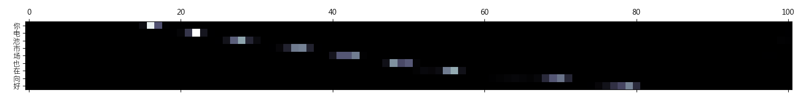

# End-to-End-Mandarin-ASR

中文語音辨識

End-to-end speech recognition on **AISHELL** dataset using Pytorch.

The entire system is an attention-based sequence-to-sequence model<sup>[1](#References)</sup>.
The encoder is a bidirectional GRU net with BatchNorm, and the decoder is another GRU net that applies Luong-based attention<sup>[3](#References)</sup>.

The acoustic features are 80-dimensional filter banks. We apply **SpecAugment**<sup>[4](#References)</sup> to these features to improve generalization.
They are also stacked every 3 consecutive frames, so the time resolution is reduced.

With this code you can achieve **~10% CER** on the test set after 100 epochs.

## Usage
### Install requirements
```bash
$ pip install -r requirements.txt
```

### Data
1. Download AISHELL dataset (data_aishell.tgz) from http://www.openslr.org/33/.
2. Extract data_aishell.tgz:
```bash
$ python extract_aishell.py ${PATH_TO_FILE}
```
3. Create lists (*.csv) of audio file paths along with their transcripts:
```bash
$ python prepare_data.py ${DIRECTORY_OF_AISHELL}
```

### Train
Check available options:
```bash
$ python train.py -h
```
Use the default configuration for training:
```bash
$ python train.py exp/default.yaml
```
You can also write your own configuration file based on `exp/default.yaml`.
```bash
$ python train.py ${PATH_TO_YOUR_CONFIG}
```

### Show loss curve
With the default configuration, the training logs are stored in `exp/default/history.csv`.
You should specify your training logs accordingly.
```bash
$ python show_history.py exp/default/history.csv
```


### Test
During training, the program will keep monitoring the error rate on development set.
The checkpoint with the lowest error rate will be saved in the logging directory (by default `exp/default/best.pth`).

To evalutate the checkpoint on test set (with a beam width of 5), run:
```bash
$ python eval.py exp/default/best.pth --beams 5
```

Or you can test random audio from the test set and see the attentions:
```bash
$ python inference.py exp/default/best.pth --beams 5

Predict:
你 电 池 市 场 也 在 向 好
Ground-truth:
锂 电 池 市 场 也 在 向 好
```


## TODO
- [x] Beam Search
- [x] Restore checkpoint and resume previous training
- [x] SpecAugment
- [ ] LM Rescoring
- [ ] Label Smoothing
- [ ] Polyak Averaging

## References
[1] W. Chan _et al._, "Listen, Attend and Spell",
https://arxiv.org/abs/1508.01211

[2] J. Chorowski _et al._, "Attention-Based Models for Speech Recognition",
https://arxiv.org/abs/1506.07503

[3] M. Luong _et al._, "Effective Approaches to Attention-based Neural Machine Translation",
https://arxiv.org/abs/1508.04025

[4] D. Park _et al._, "SpecAugment: A Simple Data Augmentation Method for Automatic Speech Recognition",
https://arxiv.org/abs/1904.08779
